#**Traffic Sign Recognition** 

---

**Build a Traffic Sign Recognition Project**

The goals / steps of this project are the following:
* Load the data set (see below for links to the project data set)
* Explore, summarize and visualize the data set
* Design, train and test a model architecture
* Use the model to make predictions on new images
* Analyze the softmax probabilities of the new images
* Summarize the results with a written report

## Rubric Points
###Here I will consider the [rubric points](https://review.udacity.com/#!/rubrics/481/view) individually and describe how I addressed each point in my implementation.  

---
### Writeup / README

#### 1. Provide a Writeup / README that includes all the rubric points and how you addressed each one. You can submit your writeup as markdown or pdf. You can use this template as a guide for writing the report. The submission includes the project code.

You're reading it! and here is a link to my [project code](https://github.com/udacity/CarND-Traffic-Sign-Classifier-Project/blob/master/Traffic_Sign_Classifier.ipynb)

###Data Set Summary & Exploration

####1. Provide a basic summary of the data set and identify where in your code the summary was done. In the code, the analysis should be done using python, numpy and/or pandas methods rather than hardcoding results manually.

The code for this step is contained in the second code cell of the IPython notebook.  

I used the pandas library to calculate summary statistics of the traffic
signs data set:

* The size of training set is 34799
* The size of test set is 12630
* The shape of a traffic sign image is 32x32
* The number of unique classes/labels in the data set is 43

#### 2. Include an exploratory visualization of the dataset and identify where the code is in your code file.

The code for this step is contained in the third code cell of the IPython notebook.  

Here is an exploratory visualization of the data set. It is a bar chart showing how the data ...

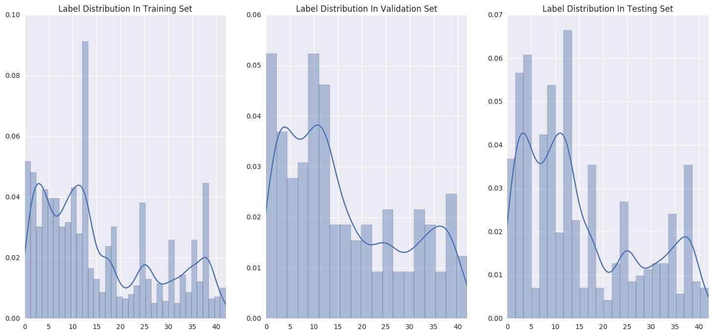
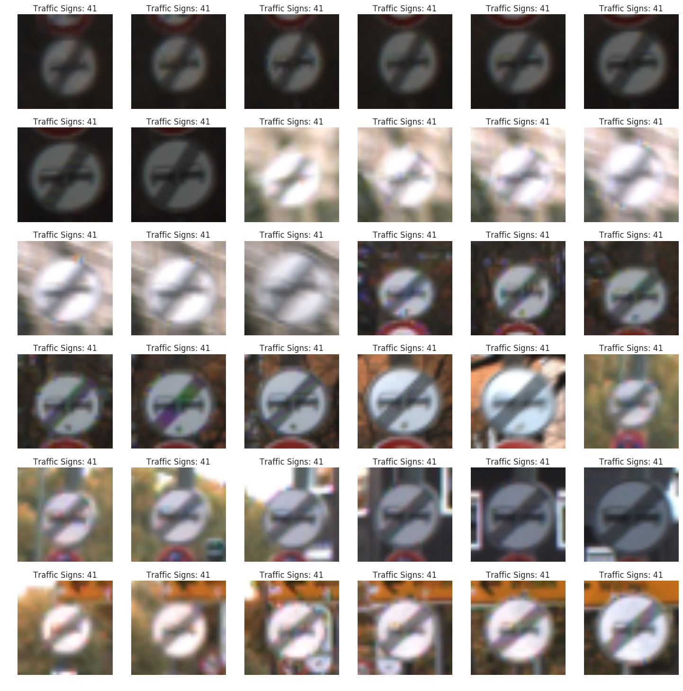

### Design and Test a Model Architecture

#### 1. Describe how, and identify where in your code, you preprocessed the image data. What tecniques were chosen and why did you choose these techniques? Consider including images showing the output of each preprocessing technique. Pre-processing refers to techniques such as converting to grayscale, normalization, etc.

The code for this step is contained in the fourth code cell of the IPython notebook.

As a first step, I decided to convert image data to float 32, and substract minus the average image.

Here is how average image look like:

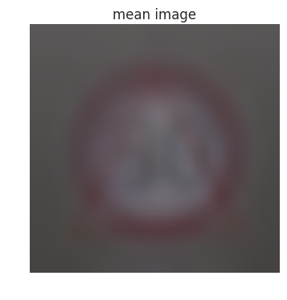

I create a BatchGenerator class to do the job of preprocessing.

In the BatchGenerator class I create the methods of \_random\_translation and \_random\_zoom to process the image. Each time when it generate new data, it will randomly chose a function to process the image. In this way, we can introduce more samples to the training data.

#### 2. Describe how, and identify where in your code, you set up training, validation and testing data. How much data was in each set? Explain what techniques were used to split the data into these sets. (OPTIONAL: As described in the "Stand Out Suggestions" part of the rubric, if you generated additional data for training, describe why you decided to generate additional data, how you generated the data, identify where in your code, and provide example images of the additional data)

The code for splitting the data into training and validation sets is contained in the 2nd code cell of the IPython notebook.  

My training set had 34799 number of images. My test set and validation set had 12630 number and 4410 number of images.

The 4th code cell of the IPython notebook contains the code for augmenting the data set. I decided to generate additional data because it can create more sample for training, and make the model became more robust. To add more data to the the data set, I used the following techniques:

- Random zoom
- Random translation

Here is an example of an original image and an augmented image:

The difference between the original data set and the augmented data set is that it will be zoomed or translated randomly.

#### 3. Describe, and identify where in your code, what your final model architecture looks like including model type, layers, layer sizes, connectivity, etc.) Consider including a diagram and/or table describing the final model.

The code for my final model is located in the seventh cell of the ipython notebook. 

My final model consisted of the following layers:

| Layer         		|     Description	        					| 
|:---------------------:|:---------------------------------------------:| 
| Input         		| 32x32x3 RGB image   							| 
| Convolution 3x3     	| 1x1 stride, same padding, outputs 32x32x8 	|
| RELU					|												|
| Convolution 3x3     	| 1x1 stride, same padding, outputs 32x32x8 	|
| RELU					|												|
| Convolution 3x3     	| 1x1 stride, same padding, outputs 32x32x8 	|
| RELU					|												|
| Max pooling	      	| 2x2 stride,  outputs 16x16x8 				    |
| Convolution 3x3     	| 1x1 stride, same padding, outputs 16x16x32 	|
| RELU					|												|
| Convolution 3x3     	| 1x1 stride, same padding, outputs 16x16x32 	|
| RELU					|												|
| Convolution 3x3     	| 1x1 stride, same padding, outputs 16x16x32 	|
| RELU					|												|
| Max pooling	      	| 2x2 stride,  outputs 8x8x32 				    |
| Convolution 3x3     	| 1x1 stride, same padding, outputs 8x8x64	 	|
| RELU					|												|
| Convolution 3x3     	| 1x1 stride, same padding, outputs 8x8x64	 	|
| RELU					|												|
| Convolution 3x3     	| 1x1 stride, same padding, outputs 8x8x64	 	|
| RELU					|												|
| Max pooling	      	| 2x2 stride,  outputs 4x4x64 				    |
| Flatten				| outputs 1024									|
| Fully connected		| outputs 128        							|
| Dropout				|												|
| Fully connected		| outputs 64        							|
| Dropout				|												|
| Fully connected		| outputs 43        							|
| Softmax				| outputs 43  									|
 

#### 4. Describe how, and identify where in your code, you trained your model. The discussion can include the type of optimizer, the batch size, number of epochs and any hyperparameters such as learning rate.

The code for training the model is located in the eigth cell of the ipython notebook. 

To train the model, I used an AdamOptimizer, the training batch size is 300 number of images. 

I set the keep rate for the dropout as 0.5 in the training state and set that as 1 when testing.

I set the learning rate as 0.001 in the begining, when I notice the model stop improving I set it as 0.0001. When model stop improving again with that new learning rate, I set it as 0.00001, so on and so forth.

#### 5. Describe the approach taken for finding a solution. Include in the discussion the results on the training, validation and test sets and where in the code these were calculated. Your approach may have been an iterative process, in which case, outline the steps you took to get to the final solution and why you chose those steps. Perhaps your solution involved an already well known implementation or architecture. In this case, discuss why you think the architecture is suitable for the current problem.

The code for calculating the accuracy of the model is located in the 8th and 9th cell of the Ipython notebook.

My final model results were:
* training set accuracy of 0.9853
* validation set accuracy of 0.9406
* test set accuracy of 0.9300

If an iterative approach was chosen:
* What was the first architecture that was tried and why was it chosen?
 - the first architect I tried is LeNet-5, and change the output number of finnal output layer to 43. I use it becouse it's a classic model.
* What were some problems with the initial architecture?
 - It is undderfitting. The training set accuracy cannot reach 90%.
* How was the architecture adjusted and why was it adjusted? Typical adjustments could include choosing a different model architecture, adding or taking away layers (pooling, dropout, convolution, etc), using an activation function or changing the activation function. One common justification for adjusting an architecture would be due to over fitting or under fitting. A high accuracy on the training set but low accuracy on the validation set indicates over fitting; a low accuracy on both sets indicates under fitting.
 - I change all convolution layer to 3x3, and use more convolution layers, and introduce more parameters on purpose. With more parameters the model can learn more thing from the image. With 3x3 convolution layer rather than 5x5 or 7x7 the model is capable of learning more detail from the image.
 - I change the activation function from sigmoid to ReLu. Becouse it's faster than sigmoid, and in someway it can avoid overfitting.
 - I introduce dropout to the full connection layers, because it can avoid overfitting.
* Which parameters were tuned? How were they adjusted and why?
 - learning rate. I adjust it when the model stop improving during training, I set $lr_{n+1} = lr_n * 0.1$. I did so because model stoping improving probably result from high learning rate. At this time with low learning rate the model can still learn something. Thus during VGG's training, the model's learning rate is scaled twice or 3 times just like what I did.
* What are some of the important design choices and why were they chosen? For example, why might a convolution layer work well with this problem? How might a dropout layer help with creating a successful model?
 - Dropout layer. In my archetecture, during training this layer will ignore 50% input(chose randomly) from previous layer, and pass the other 50% input to next layer. Dropout layer bring noise to the model during training, which prevent the model from overfitting to the limited input sample.
 - 3x3 Convolution layer and deeper. Increasing depth using architecture with very small (3x3) convolution filter can make significant improvement (Very Deep Convolutional Networks for Large-Scale Image Recognition).

### Test a Model on New Images

#### 1. Choose five German traffic signs found on the web and provide them in the report. For each image, discuss what quality or qualities might be difficult to classify.

Here are five German traffic signs that I found on the web:

 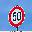 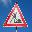 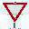 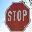

#### 2. Discuss the model's predictions on these new traffic signs and compare the results to predicting on the test set. Identify where in your code predictions were made. At a minimum, discuss what the predictions were, the accuracy on these new predictions, and compare the accuracy to the accuracy on the test set (OPTIONAL: Discuss the results in more detail as described in the "Stand Out Suggestions" part of the rubric).

The code for making predictions on my final model is located in the 11th cell of the Ipython notebook.

Here are the results of the prediction:

| Image			        |     Prediction	        					| 
|:---------------------:|:---------------------------------------------:| 
| Roundabout mandatory	| Roundabout mandatory							| 
| Road word     		| Road word										|
| Speed limit(50 km/h)	| Speed limit(50 km/h)			 				|
| Stop					| Stop			      							|
| Yield					| Yield											|

The model was able to correctly guess 5 of the 5 traffic signs, which gives an accuracy of 100%.

#### 3. Describe how certain the model is when predicting on each of the five new images by looking at the softmax probabilities for each prediction and identify where in your code softmax probabilities were outputted. Provide the top 5 softmax probabilities for each image along with the sign type of each probability. (OPTIONAL: as described in the "Stand Out Suggestions" part of the rubric, visualizations can also be provided such as bar charts)

(The code for this part is in the notebook. I didn't save it to the .html file.)
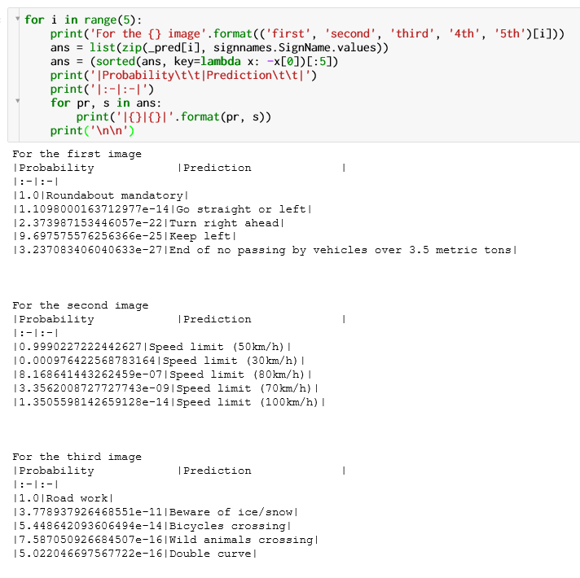

For the first image

|Probability		|Prediction		|
|:-|:-|
|1.0|Roundabout mandatory|
|1.1098000163712977e-14|Go straight or left|
|2.373987153446057e-22|Turn right ahead|
|9.697575576256366e-25|Keep left|
|3.237083406040633e-27|End of no passing by vehicles over 3.5 metric tons|

For the second image

|Probability		|Prediction		|
|:--:|:--:|
|0.9990227222442627|Speed limit (50km/h)|
|0.000976422568783164|Speed limit (30km/h)|
|8.168641443262459e-07|Speed limit (80km/h)|
|3.3562008727727743e-09|Speed limit (70km/h)|
|1.3505598142659128e-14|Speed limit (100km/h)|

For the third image

|Probability		|Prediction		|
|:-|:-|
|1.0|Road work|
|3.778937926468551e-11|Beware of ice/snow|
|5.448642093606494e-14|Bicycles crossing|
|7.587050926684507e-16|Wild animals crossing|
|5.022046697567722e-16|Double curve|

For the 4th image

|Probability		|Prediction		|
|:-|:-|
|1.0|Yield|
|0.0|Speed limit (20km/h)|
|0.0|Speed limit (30km/h)|
|0.0|Speed limit (50km/h)|
|0.0|Speed limit (60km/h)|

For the 5th image

|Probability		|Prediction		|
|:-|:-|
|0.9996176958084106|Stop|
|0.0003821736027020961|Yield|
|4.6791406305146666e-08|Speed limit (30km/h)|
|2.1111951298280474e-08|No vehicles|
|1.7812290309393575e-08|Priority road|

### Feature Map

#### Feature map of conv11
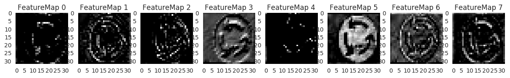

#### Feature map of conv12
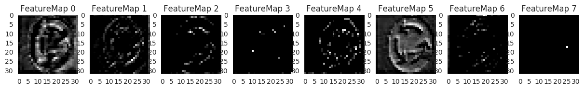

#### Feature map of conv13
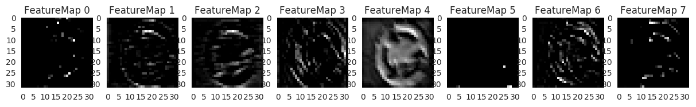

#### Feature map of conv21
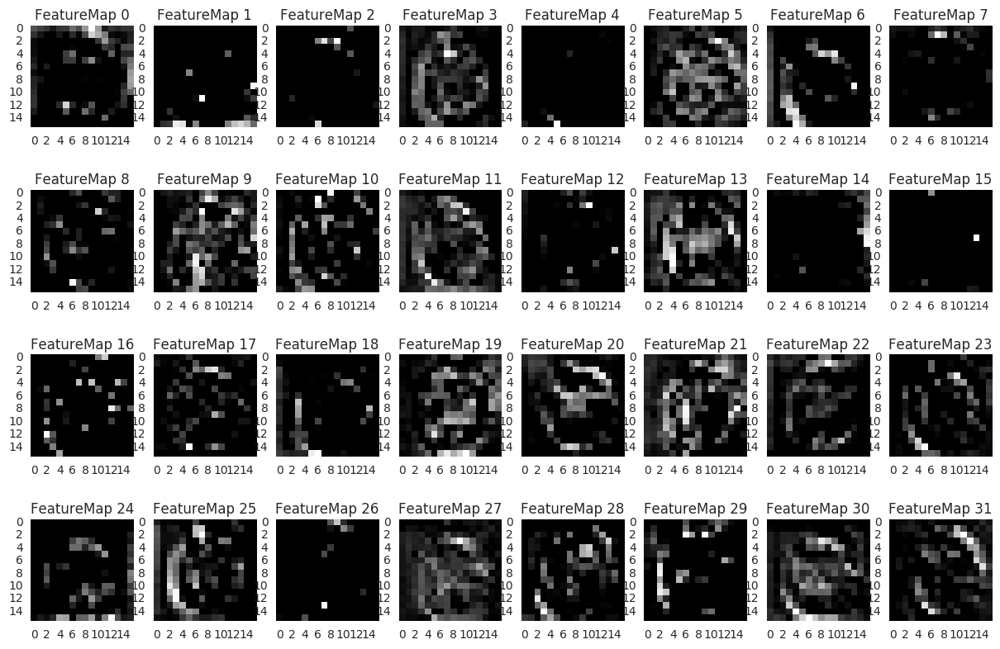
